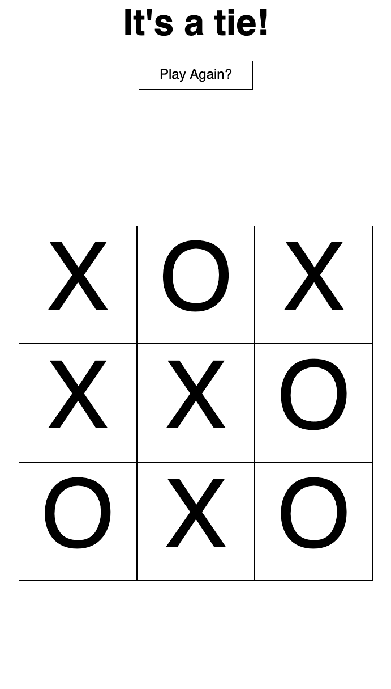

# Tic-Tac-Toe Project!

A live implementation of the project can be found at this [GitHub Pages Link](https://lilyrubyroy.github.io/tic-tac-toe/).

  
  
  
  

## Technical Design Choices

### Bitmaps!

I'm always trying to implement something radically different and new in each project. They had originally asked for
an array-based positioning system for the board and the user/computer pieces, but this felt a little too trivial
to do with just a series of if/switch statements. Instead, since the game is quite simple, I decided to integrate
a bitmap design! 

The only object used, apart from the initial IIFE, was the POSITION_SHIFTS object, which was a remnant of a console-based
implementation of the project. I then adapted it into a coordinate-system that would be used as a helper object for the 
draw function.

#### User/Computer Choices

I used a 9-bit, 0b000000000, representation for each of the User and Computer players. Each bit represents a position 
currently taken on the board. The bits go from the top-left of the board, to the bottom-right, in-order.

A bit-mask was used in conjunction with my coordinates object to help me figure out how many bits I needed to shift to 
test if the space was currently occupied within the board. The board was represented as an OR'd version of the user
and computer states, giving me an update-to-date representation of what was available. 

Finally, I'd check to see if the current player's move won them the game. Since tic-tac-toe has a limited number of
win states, I just needed to AND the player's current state with all of the win states, and if any matched the win
state on its own, then that means the player had won.

If the player didn't win, I also checked to see if the board was full, and if it was, then that means the game had to have
ended in a draw.

#### Future Changes

As of now, the computer only picks a random move from a list of currently available moves. In the future, I'd like to
implement a variety of difficulties.
- Easy 
  - The above implemenation, where it selects random moves.
- Impossible
  - An min-max algorithm implementation where the computer will always play optimally. Since the game is actually solved,
    this means that the game will always end in either a win or a draw for the computer player, given optimal play by the human.
- Hard
  - A mix of the two above implementations, where I just run a quick random test to see which play-style it will use for the 
  current turn.
